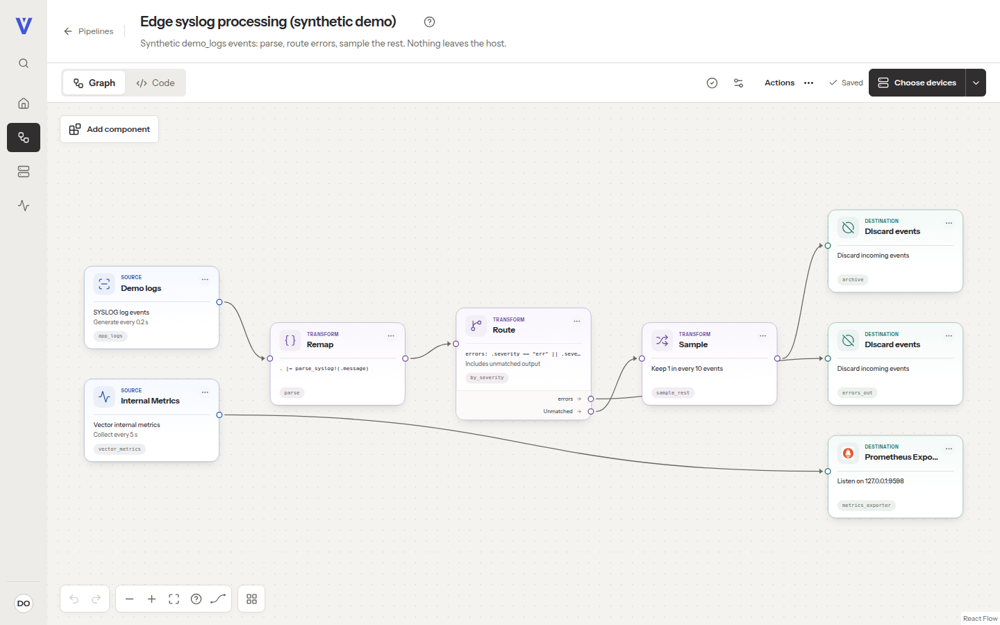
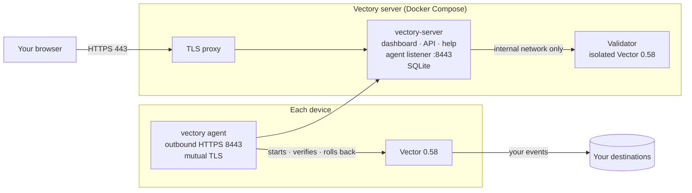
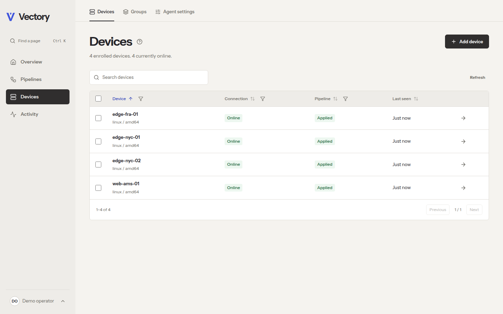
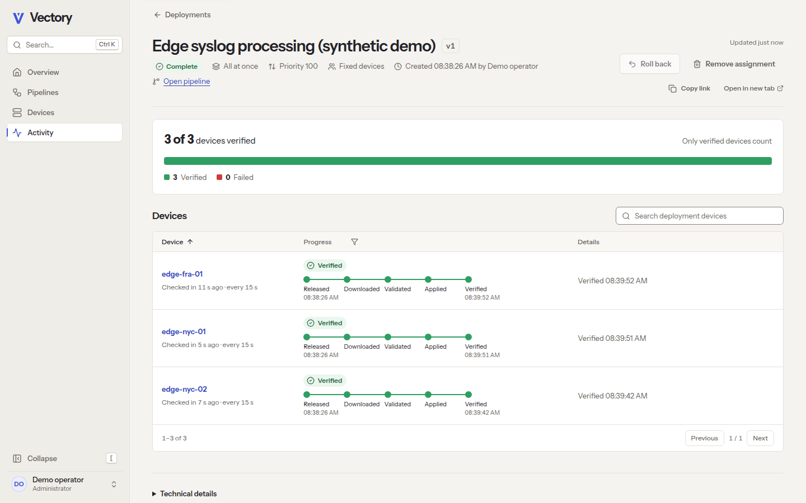
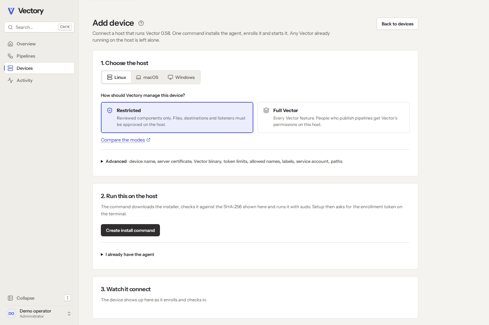

# Vectory

**Design, ship and roll back Vector pipelines across your fleet, from one self-hosted dashboard.**

[Quickstart](docs/user/quickstart.md) · [Docs](docs/user/getting-started.md) · [How it works](#how-it-works) · [Project status](#project-status)

<picture>
  <source media="(prefers-color-scheme: dark)" srcset="docs/screenshots/product-editor-dark.png">
  
</picture>

Vectory is an open-source control plane for [Vector](https://vector.dev/). Build a pipeline in your browser, publish it as an immutable version, and roll it out to the hosts you choose, with previews, canaries, schedules and rollback. A small agent on each host applies the change and reports what Vector is actually running.

## Why Vectory

| | |
| --- | --- |
| **A visual editor for real Vector** | Schema-driven settings for all 128 component types of Vector 0.58, eight starter pipelines that pass Vector 0.58.0's own validation, VRL with sample tests, and YAML, TOML or JSON import and export. Every version is checked by an isolated Vector 0.58 validator; checks that need the device run on the device before it applies. |
| **Rollouts you can trust** | Immutable versions with diffs, device and group targeting with a preview, canaries that advance only when devices confirm, schedules and one-step rollback. |
| **Outbound-only agents** | The agent dials out over TLS 1.3 with mutual TLS. Nothing on your hosts listens for Vectory. |
| **Your data stays yours** | Events flow from Vector to your destinations, never through Vectory. Credentials stay on each host as `vectory-secret:NAME` references. |
| **Guardrails built in** | Roles, two-factor sign-in and an exportable audit log. Signed per-device configurations. A local policy on each host that the server can't widen. |
| **Self-hosted, no strings** | Docker Compose and SQLite. No cloud account, analytics or outside CDN. Apache-2.0. |

## How it works

1. **Build** a pipeline in the dashboard. An isolated Vector validates it.
2. **Publish** an immutable version and **deploy** it to devices or groups: all at once, as a canary, or on a schedule.
3. The **agent** fetches its signed configuration, validates it with Vector, applies it and confirms Vector is running it. If it fails, the agent restores the last working version.

## Get started

- **Try it on one machine** (Linux or macOS, about 15 minutes, mostly compiling): [Quickstart](docs/user/quickstart.md). After its first step, `node scripts/demo.mjs` starts a local demo fleet of real agents on synthetic data.
- **Run it for real:** [Install the server](docs/user/install-server.md), [Connect a device](docs/user/installation.md), [Deploy your first pipeline](docs/user/first-pipeline.md).
- **Understand the guarantees:** [Security model](docs/user/security.md).

The same guides ship inside every server as a searchable, offline Help center at `/help/`.

<table>
  <tr>
    <td width="33%"></td>
    <td width="33%"></td>
    <td width="33%"></td>
  </tr>
  <tr>
    <td align="center">Every device, and what it runs</td>
    <td align="center">Rollouts you can follow</td>
    <td align="center">Guided setup for each device</td>
  </tr>
</table>

## Project status

Vectory is a **0.1 developer preview**, and nothing in it is signed. The full loop (build, publish, canary, apply and roll back) runs against real Vector 0.58.0 agents on Linux, macOS and Windows. On every change CI runs the agent's native tests with Vector 0.58.0 on all three, a browser suite, and the Compose server stack on a clean runner. A second workflow, run on demand, installs the agent as a real operating-system service (systemd, launchd and the Windows service), runs the loop through it, restarts, kills and stops it, updates it to a newer build through a rollout and shows it taking back a build that fails; it also runs the first-use flows in Firefox and WebKit.

Not done yet: published images and packages, signed releases, reboot and upgrade tests, service tests on distributions other than Ubuntu 24.04, and tests on Arm64 hardware. Agent updates are built in and off until an administrator turns them on: a host agrees to them once, in the command that installs or upgrades it, and after that the dashboard rolls out signed builds with a canary first and an automatic rollback on each host. Any other agent is upgraded on its host, one command per device. See [Compatibility](docs/user/compatibility.md) for minimums and what is tested where, the [roadmap](docs/ROADMAP.md) for what's next, and the [requirements checklist](docs/internal/REQUIREMENTS.md) for the test behind each requirement.

## Develop

Vectory is a Rust (Axum, SQLite) server, a React and TypeScript dashboard, a Go agent and an Astro Starlight Help center. [CONTRIBUTING.md](CONTRIBUTING.md) lists the toolchain and how to run every test; [docs/dev/DEVELOPMENT.md](docs/dev/DEVELOPMENT.md) covers the local preview and the demo fleet.

| Folder | Contents |
| --- | --- |
| `server/` | API, agent listener, validator and `vectory-admin` |
| `dashboard/` | The web app and its browser tests |
| `agent/` | The `vectory` agent |
| `help-center/` | Help center build; its pages live in `docs/user/` |
| `contracts/` | OpenAPI and agent protocol contracts |
| `vector-catalog/` | Vector 0.58 component metadata and fixtures |
| `deploy/`, `packaging/` | Docker Compose, container images and release tooling |

## Contributing, security and license

Contributions are welcome: start with [CONTRIBUTING.md](CONTRIBUTING.md). Report vulnerabilities privately as described in [SECURITY.md](SECURITY.md). Vectory is licensed under [Apache-2.0](LICENSE).

Vectory is an independent project. It is not affiliated with or endorsed by Datadog or the Vector project.
