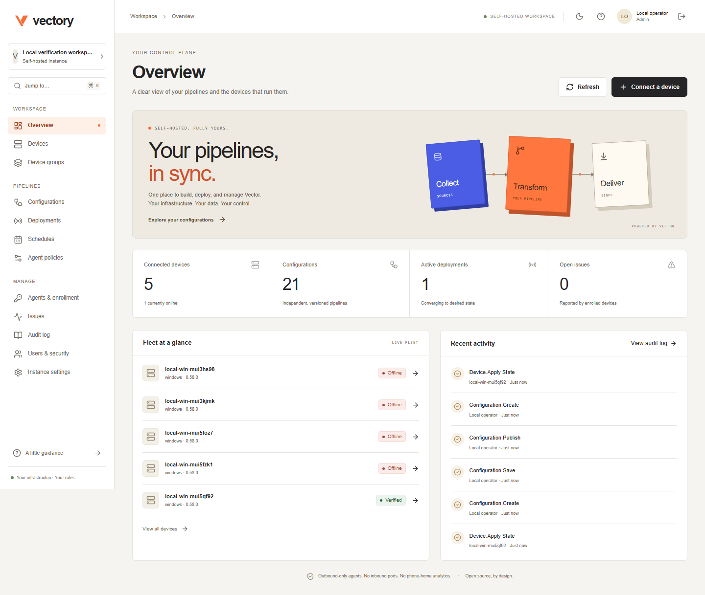

# Vectory

An open-source, self-hosted control plane for [Vector](https://vector.dev/). Build pipelines visually, publish immutable versions, and roll them out to explicitly enrolled devices. Rust API, React/TypeScript dashboard, SQLite persistence, and a portable Go agent. Apache 2.0.



**Development build, with working native integration.** This repository includes the product, tests, packaging and operational guides. Production qualification remains open: native service/reboot/upgrade checks on the declared operating systems, clean Docker deployment, signed distribution, and sustained load/fault testing. See [executed evidence and release gates](docs/ACCEPTANCE.md), [compatibility](docs/COMPATIBILITY.md), and the measured [capacity boundary](docs/CAPACITY.md).

## What works

- Secure first-administrator bootstrap, local role-based accounts, MFA/recovery codes, CSRF-protected cookie sessions, and audit export.
- Fleet, static groups, enrollment/downloads, policies, deployments, schedules, issues and device recovery. No default credentials or fake release links.
- React Flow editor with 13 curated Vector components, named outputs, compatibility checks, YAML/TOML/JSON import/export, raw fields, VRL sample testing in an isolated worker, draft autosave/concurrency handling, immutable history and diffs.
- Explicit selector previews, priorities/conflicts, durable scheduled snapshots, persistent group targeting, canary/batch observation gates, rollback, retry, unassignment and local/remote pause.
- Outbound TLS enrollment and mTLS heartbeats, device-bound signed manifests, active revocation, key renewal, monotonic state, actual-file drift detection, journaled apply/verified rollback and local capability restrictions.
- Real native Vector activation, device-local secret references and journaled rotation at the same configuration generation. Secret values stay on the managed host.
- Optional bounded loopback metrics with component counters and persisted minute history. Unavailable telemetry stays unavailable. The server does not ingest your pipeline events.

The dashboard uses an original visual design inspired by Base44: warm neutral surfaces, bold type, orange/cobalt accents and geometric pipeline artwork. It includes responsive layouts, a dark theme, keyboard controls and automated accessibility checks. No runtime font/CDN, analytics, billing, hosted identity, license server or cloud account is required.

## Run it

Use the [Compose quickstart](docs/QUICKSTART.md) for the server deployment and [agent installation guide](docs/AGENT-INSTALL.md) for managed hosts. Compose packages the dashboard with the API, a TLS proxy, SQLite state and an isolated pinned Vector validation worker. TLS keys and the bootstrap secret are provided locally. The agent listener uses verified TLS on port 8443.

For development on this Windows workspace, see [local demonstration](docs/LOCAL-DEMO.md). The demonstration uses explicitly synthetic events, a private loopback server, a separately trusted test CA and an already-downloaded official Vector binary. It does not register a system service or change the OS trust store.

Vector is never silently installed, replaced or upgraded. Adoption requires the host operator to identify and stop the old instance, inventory its effective configuration, and explicitly authorize one managed file and fixed executable. Read the [agent security boundary](agent/README.md) before adoption.

## Repository and verification

| Directory | Contents |
| --- | --- |
| `server/` | Axum/Tokio API, SQLx SQLite migrations, device listener, validation worker, maintenance CLI |
| `dashboard/` | React/TypeScript UI, unit and real-server Playwright tests |
| `agent/` | Go agent, native adapters, protocol/recovery and real Vector tests |
| `contracts/` | Shared JSON Schema, generated OpenAPI, protocol/state contract |
| `vector-catalog/` | Versioned component metadata and actual Vector validation fixtures |
| `deploy/`, `packaging/` | Compose, container/service definitions, unsigned offline development archives, backup/release tools |
| `tests/`, `docs/` | Independent TLS/security/load checks, evidence, architecture and operator guides |

```sh
cd dashboard
npm ci
npm run build
npm test
cd ../server
cargo test --locked
cd ../agent
go test ./...
go vet ./...
```

Native tests additionally require an independently verified Vector binary; browser and live-contract checks require the isolated demonstration. [Testing instructions](docs/LOCAL-DEMO.md) distinguish these checks. Cross-compilation is not native compatibility evidence. Checksums are not release signatures.

Read [threat model](docs/THREAT-MODEL.md), [security review](docs/SECURITY-REVIEW.md), [backup/restore](docs/BACKUP-RESTORE.md), [troubleshooting](docs/TROUBLESHOOTING.md), [contribution guide](CONTRIBUTING.md) and [security reporting](SECURITY.md). The full [implementation specification](docs/product-specification.md) and [architecture decision](docs/adr/0001-architecture.md) remain in the repository for review.
