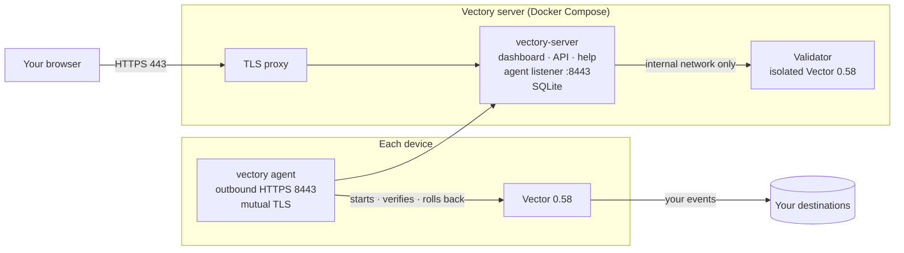

<div align="center">

# Vectory

**Design, ship and roll back Vector pipelines across your fleet, from one self-hosted dashboard.**

[Quickstart](docs/user/quickstart.md) · [Download](https://github.com/416rehman/Vectory/releases/tag/v0.2.0) · [Docs](docs/user/getting-started.md) · [How it works](#how-it-works) · [Compatibility](#deployment-and-compatibility)

<picture>
  <source media="(prefers-color-scheme: dark)" srcset="docs/screenshots/product-editor-dark.png">
  
</picture>

</div>

Vectory is an open-source control plane for [Vector](https://vector.dev/). Build a pipeline in your browser, publish it as an immutable version, and roll it out to the hosts you choose, with previews, canaries, schedules and rollback. A small agent on each host applies the change and reports what Vector is actually running.

## Why Vectory

| | |
| --- | --- |
| **A visual editor for real Vector** | Schema-driven settings for all 128 component types of Vector 0.58, eight starter pipelines that pass Vector 0.58.0's own validation, VRL with sample tests, and YAML, TOML or JSON import and export. Publication checks the pipeline structure and uses an isolated Vector 0.58 validator where safe; configuration providers and other device-only checks run on each device before it applies. |
| **Rollouts you can trust** | Immutable versions with diffs, device and group targeting with a preview, canaries that advance only when devices confirm, schedules and one-step rollback. |
| **Outbound-only agents** | The agent dials out over TLS 1.3 with mutual TLS. Nothing on your hosts listens for Vectory. |
| **Your data stays yours** | Events flow from Vector to your destinations, never through Vectory. Supported credential fields use device-local `vectory-secret:NAME` references; headers and URLs require native Vector secret providers or host-managed environment references in full mode. |
| **Guardrails built in** | Roles, two-factor sign-in and an exportable audit log. Signed per-device configurations. A local policy on each host that the server can't widen. |
| **Self-hosted, no strings** | Docker Compose and SQLite. No cloud account, analytics or outside CDN. Apache-2.0. |

## How it works



1. **Build** a pipeline in the dashboard. An isolated Vector validates it.
2. **Publish** an immutable version and **deploy** it to devices or groups: all at once, as a canary, or on a schedule.
3. The **agent** fetches its signed configuration, validates it with Vector, applies it and confirms Vector is running it. If it fails, the agent restores the last working version.

## Get started

On a Linux x86-64 server with Docker Engine and Compose v2 running, point a DNS name at the server and run:

```sh
curl -fsSL --proto '=https' https://vectory.ahmadz.ai/install.sh -o vectory-install.sh &&
bash vectory-install.sh
```

Enter your hostname. The installer verifies the release signature and signed GHCR image digests, starts Vectory, and sets up automatic HTTPS. Open the printed URL and create your first administrator with the one-time setup secret. No Git, Rust, Go, Node.js or compiler is needed.

Then open **Devices → Add device**. Copy the command for Linux, macOS or Windows, run it on a host with Vector 0.58.x installed, and paste the enrollment token when prompted. The agent download, certificate trust and service setup are handled for you. Tokens stay out of URLs and commands.

- [Quickstart](docs/user/quickstart.md): server, first device and first pipeline.
- [Server installation](docs/user/install-server.md): custom certificates, offline use and operations.
- [Compatibility](docs/user/compatibility.md): platforms and actual test coverage.
- [Security model](docs/user/security.md): roles, host permissions and signatures.

Want to inspect a configuration first? The [standalone Vector designer](https://vectory.ahmadz.ai/designer/) creates, imports, visualizes and exports YAML, JSON and TOML in your browser without an account.

The [0.2.0 release](https://github.com/416rehman/Vectory/releases/tag/v0.2.0) supplies prebuilt agents, server kits, image archives, checksums, Sigstore bundles, SBOMs and dependency scan results. Container images are available from GHCR by immutable digest. Release verification uses GitHub OIDC and Cosign; native OS trust prompts and the agent's runtime update signatures are separate mechanisms.

The same guides ship inside every server as a searchable, offline Help center at `/help/`.

<table>
  <tr>
    <td width="33%"></td>
    <td width="33%"></td>
    <td width="33%"></td>
  </tr>
  <tr>
    <td align="center">Every device, and what it runs</td>
    <td align="center">Rollouts you can follow</td>
    <td align="center">Guided setup for each device</td>
  </tr>
</table>

## Deployment and compatibility

Vectory runs the full build, publish, canary, apply and rollback workflow against real Vector 0.58.0 on Linux, macOS and Windows. CI tests the application, browser flows and isolated Compose stack. Tagged releases also run native operating-system service and update tests before images and downloads are published.

The server supports one Linux x86-64 installation with local SQLite storage. Agents ship for Linux x86-64 and Arm64, Intel and Apple silicon Macs, and Windows x86-64; Vector itself limits which hosts can run a managed pipeline. Cosign authenticates release artifacts and GHCR digests through the release workflow identity. It does not replace Windows Authenticode or Apple notarization, and it does not certify every customer's workload or host environment.

See [Compatibility](docs/user/compatibility.md) for the exact tested systems, [Operational limits](docs/user/whats-new.md#known-limits) for remaining constraints, and the [requirements checklist](docs/internal/REQUIREMENTS.md) for the checks behind each requirement. Start new deployments with a canary and retain tested backups.

## Develop

Vectory is a Rust (Axum, SQLite) server, a React and TypeScript dashboard, a Go agent and an Astro Starlight Help center. [CONTRIBUTING.md](CONTRIBUTING.md) lists the toolchain and how to run every test; [docs/dev/DEVELOPMENT.md](docs/dev/DEVELOPMENT.md) covers the local preview and the demo fleet.

| Folder | Contents |
| --- | --- |
| `server/` | API, agent listener, validator and `vectory-admin` |
| `dashboard/` | The web app and its browser tests |
| `agent/` | The `vectory` agent |
| `help-center/` | Help center build; its pages live in `docs/user/` |
| `contracts/` | OpenAPI and agent protocol contracts |
| `vector-catalog/` | Vector 0.58 component metadata and fixtures |
| `deploy/`, `packaging/` | Docker Compose, container images and release tooling |

## Contributing, security and license

Contributions are welcome: start with [CONTRIBUTING.md](CONTRIBUTING.md). Report vulnerabilities privately as described in [SECURITY.md](SECURITY.md). For project or business inquiries, contact [416rehman@ahmadz.ai](mailto:416rehman@ahmadz.ai). Vectory's own code is licensed under [Apache-2.0](LICENSE).

Third-party components retain their licenses and copyright notices in [NOTICE](NOTICE). The compiled documentation search includes GPL-covered code; its corresponding source and provenance are included in the release downloads and under `/help/legal/` in the installed Help center. These source materials are optional for rebuilding. Installation uses the prebuilt kits.

Vectory is an independent project. It is not affiliated with or endorsed by Datadog or the Vector project.
