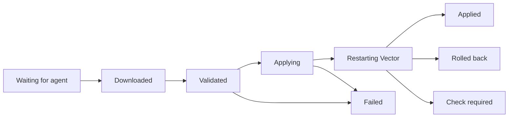

# Deploy and roll back

A deployment sends one published version, or a set of agent settings, to the devices you choose. Publishing freezes a version; deploying decides who gets it and when. Deploying needs the Operator or Administrator role.

## Deploy a published version

<!-- steps -->
1. Open the pipeline and choose **Review & publish** for the current draft, or **Choose devices** if it's already published.
2. Select devices, groups or both. Exclude any group members that shouldn't get it.
3. Choose how to release it: all at once, as a canary, or on a schedule. See [Choose a rollout](#choose-a-rollout).
4. Choose **Review deployment**. Check the exact device list, what each device runs now and what it will run after.
5. Choose **Deploy to devices**, then **View deployment** to follow it.

Deploying a new version of a pipeline to devices that run an older version of it replaces the older one there. The review says so, for example "Replace Web access logs v2 → v3 on 3 devices".

After a rollback, deploying a fix of the same pipeline also replaces the rolled-back rollout and its rollback, at the rollback's priority, so every device takes the fix in one review. If an assignment still outranks some devices, the button reads **Deploy to 2 of 3 devices** and asks you to confirm what stays behind, for example "edge-nyc-02 keeps Edge syslog processing v1 (priority 101 rollback)".

Choosing devices doesn't publish unsaved edits. [Check and publish](pipelines.md#validate-test-publish) first.

## Review the target set

The target set is every device you selected, plus the members of every group you selected, minus exclusions. The review lists the actual devices, so check it rather than the counts.

| Membership | Behavior | Use it for |
| --- | --- | --- |
| **Only the selected devices** | Fixed when you deploy. | A controlled release to a reviewed list. |
| **Also include future group members** | Follows group membership. New members get the version too. | Groups whose new devices should inherit it. |

Scheduled deployments always use a fixed list.

The review also blocks devices that can't run the version, and says why:

- **Full mode needed.** The version uses something only full-mode devices allow. Only the host can [switch modes](agents.md#switch-between-restricted-and-full-mode).
- **Wrong Vector version.** The device doesn't report a Vector 0.58.x release.

The server checks again when the deployment starts, at each canary stage and when group membership changes, so a device that changes after your review is never slipped in. Devices can still fail for host reasons, such as a missing file or credential.

## Review changes to a group

Groups can carry pipeline and agent-settings deployments that include future members, so editing a group can change what devices run.

- The group editor previews the effect: which devices would get or lose a pipeline.
- If someone else changed the group while you were editing, **This group changed** shows their version next to yours. Choose **Use latest name**, **Use latest description** or **Use latest members**, or keep your edits, then **Save changes**.
- A group change that would add devices to a canary that's still running is refused, with a link to that canary.

## Understand priority

When several deployments target the same device, the highest priority wins. Pipelines and agent settings are separate: each has its own winner.

- A pipeline deployment at priority 200 beats one at 100.
- Two different pipelines at the same winning priority conflict. Vectory never picks one arbitrarily; the review shows the conflict and the deployment that holds that priority.
- Resolve a conflict by choosing a higher priority in **Advanced options**, or by removing the deployment you no longer need.
- **Current winner** names what each device follows today, such as a rollback one priority up, and **Also bound** lists what else still holds it at your priority. **Replace existing** replaces all of them at once.

Vectory never raises a priority for you. **No current priority conflict** means only that priorities allow the change; the device still has to accept it.

## Choose a rollout

| Rollout | What happens |
| --- | --- |
| **All at once** | Every target gets the version now. |
| **Canary, then batches** | A few devices first. After an observation period, if they apply cleanly, the rest follow in batches. |
| **Scheduled** | The deployment starts at the time you choose. The target list is fixed when you schedule it. |

For a first canary, try one device, a batch size that suits your fleet and a few minutes of observation.

Only **Applied** counts toward a canary. Offline, failed and unconfirmed devices hold the rollout, and if more devices fail than you allow, the rollout stops before releasing more.

While a canary runs, **Canary gate** shows what each released device still needs:

| Gate message | What to check |
| --- | --- |
| **Another assignment is effective** | Something with a higher priority now wins on this device. |
| **Waiting for a fresh heartbeat** | The device hasn't checked in recently. An earlier success doesn't count. |
| **Configuration sync is paused** | A pause set on the host or in agent settings. Only the host can clear a host pause. |
| **Current application is not verified** | The device doesn't report **Applied** for this version. |
| **Device is unavailable** | The device was revoked or replaced. A replacement identity isn't counted. |

**Observation in progress** means Vectory is watching fresh evidence for the whole period; it isn't a countdown. Pausing the rollout, or losing evidence, restarts the observation.

## Read the apply states

<!-- diagram: apply-states -->

| State | What it establishes | What to do |
| --- | --- | --- |
| **Waiting for agent**, **Downloaded**, **Validated** | Released, or preparation succeeded. | Wait. None of these means Vector runs the version. |
| **Applying**, **Restarting Vector** | The configuration is written and Vector is loading it. | Wait for a final state. |
| **Applied** | The agent verified Vector runs this version. | Check that data arrives where you expect. |
| **Failed** | Rejected or couldn't be applied; the previous configuration keeps running. | Read the device's issue, fix the cause, then retry. |
| **Rolled back** | The version failed to start, so the agent restored the last working one. | Investigate the version. The device still wants it. |
| **Check required** | Applied, but the agent couldn't confirm what Vector runs. | Look at the device before retrying. |
| **Sync paused** | Configuration changes wait until sync resumes. | Resume where it was paused: `vectory resume` on the host, or in agent settings. |

An offline device's last state is history, not the present. It becomes current again when the device checks in.

## Follow a rollout

Open [**Activity → Deployments**](/#/deployments) and select a deployment. Its page shows how many devices applied, are applying, are waiting or failed, each canary stage and batch, and every device's timeline: **Released**, **Downloaded**, **Validated**, **Written**, **Vector reloaded** and **Applied**, the same steps as on the device page. A failure marks the step that failed, for example **Vector reloaded** for a port that's already in use. Failures are grouped by reason, and each reason is printed once. The page's address is its link: share it with anyone who has an account.

The page leads with the one action that fits:

| When | First action |
| --- | --- |
| It was rolled back | **Open rollback** names what the devices returned to, for example "Open rollback (Edge syslog processing v1)". |
| A device still runs it but isn't delivering | A banner names the device, the step it can't deliver to and how full that buffer is. **Roll back edge-nyc-02** comes first. |
| Only the pipeline can fix the failure: a port in use, a VRL error or an invalid option | **Fix in pipeline** opens the pipeline. **Retry failed** comes second, since a retry sends the same version. |
| Devices failed for another reason | **Retry failed**. |
| It's paused | **Resume**. |

The Overview's **Needs you** lists what still needs a person, most urgent first: devices that aren't delivering, then failed applies, then rollouts that stopped by themselves. A device problem and the rollout it stopped read as one item, with **Roll back** when the server can review that rollback. A rolled-back rollout is resolved: it leaves **Needs you** and stays in **Recent changes**. **Dismiss** hides a stopped rollout for you in this browser; if it fails again, it comes back.

## Find a deployment or device result

[**Activity → Deployments**](/#/deployments) lists every deployment. Search by pipeline, deployment name, version or status, and filter the **Status** column to what needs attention, what's in progress or what finished. [**Scheduled**](/#/schedules) lists upcoming, completed, cancelled and missed schedules, in your browser's time zone.

Inside a deployment, search **Device results** or filter them by progress. Only **Applied and verified** counts as verified. A device that left the deployment, for example because it was revoked, shows **No longer targeted**: it keeps its place in history but no longer counts.

Before a schedule starts, **Update scheduled devices** compares its saved device list with current group membership. Review who is added and removed, then confirm. If anything changes while you review, refresh the review and confirm again.

## Pause, cancel and remove

A rollout's **Stop rollout** menu (**Roll back or remove** once it finished) holds these actions, each with a line on what it does:

| Action | Effect |
| --- | --- |
| **Pause** | Stops releasing to more devices; resume later. Devices already updated keep the version. |
| **Cancel** | Stops releasing for good. Devices already updated keep the version. |
| **Roll back** | Returns the devices it released to their previous version. See [Roll back deliberately](#roll-back-deliberately). |
| **Remove assignment** | Removes the deployment, so each device falls back to its next-highest assignment. It never stops Vector. |
| **Pause configuration sync** (agent settings) | Devices keep their current configuration and stop applying new versions. |
| `vectory pause` on a device | The same, set by the host. Only the host can clear it. |

**Remove assignment** first shows what each device runs afterwards, by name: for example **Keeps Edge syslog processing v1 (no change)** or **Switches to Web access logs v2**. A device with nothing else assigned keeps running its current configuration, unmanaged. If anything changes before you confirm, refresh the review.

**Resume rollout** checks for overlapping canaries first and stays paused if one is running.

## Save and apply agent settings

Agent settings control check-ins, configuration sync and metrics collection. They deploy like pipelines, with their own priorities.

<!-- steps -->
1. In [**Devices → Agent settings**](/#/policies), choose **New settings** and name them.
2. Set the check-in interval (10 seconds to 1 hour; 60 seconds by default), whether configuration sync is paused, and whether metrics are collected.
3. Choose **Save settings**. Nothing changes on devices yet.
4. Choose **Apply to devices**, review the devices and priority, and confirm.

A device confirms new settings at its next check-in. Agent settings can't change a device's mode or its local allowances.

## Roll back deliberately

A rollback deploys an earlier version as a new change. History never changes, and each device checks the older version against today's files and credentials, like any new version.

<!-- steps -->
1. Open the pipeline's [**Actions → Version history**](/#/configurations?panel=history).
2. Select the version to go back to and choose **Deploy this version**.
3. Review the devices, priority and rollout as carefully as for a new release, then confirm.
4. Wait for **Applied** on each device.

From a deployment, **Roll back** prepares this for you. **Review rollback** says who returns to what and what each device it leaves out runs afterwards, for example "edge-nyc-02 returns to Edge syslog processing v1. edge-fra-01 and edge-nyc-01 never received r15-demo v1 and keep Edge syslog processing v1 (no change)." The rollback takes over one priority above the rollout. Only **Roll back N devices** sends it.

A canary that's still running rolls back in the same step: confirming stops the rollout and returns the devices it reached. If stopping it would switch a device it never reached to another version, or leave one without a pipeline, the review names that device and offers **Cancel rollout, then review rollback**.

Devices that ran their own local configuration before this deployment have nothing to roll back to. For them, **Remove assignment** returns them to that configuration.

After a failed attempt, fix the cause, then use **Retry application** on the device or deploy a corrected version. A device doesn't retry a failed version by itself, so it can't restart Vector in a loop. Retrying one device doesn't restart a canary that stopped; deploy again with the rollout you want.
