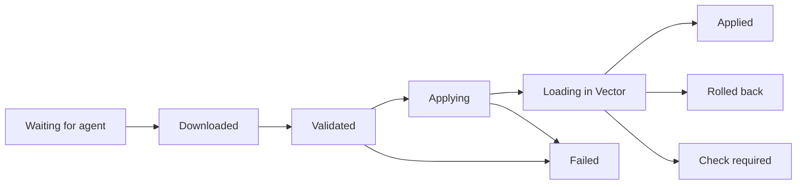

# Deploy and roll back

A deployment sends one published version, or a set of agent settings, to the devices you choose. Publishing freezes a version; deploying decides who gets it and when. Deploying needs the Operator or Administrator role.

## Deploy a published version

<!-- steps -->
1. Open the pipeline and choose **Review & publish** for the current draft, or **Choose devices** if it's already published.
2. Select devices, groups or both. Exclude any group members that shouldn't get it.
3. Choose how to release it: all at once, as a canary, or on a schedule. See [Choose a rollout](#choose-a-rollout).
4. Choose **Review deployment**. Check the exact device list, what each device runs now and what it will run after.
5. Choose **Deploy to devices**, then **View deployment** to follow it.

When devices already run a version of this pipeline, the dialog opens with them chosen and says so in one line, for example **Update the 3 devices running v1 (Edge collectors)**, under the title **Deploy Edge syslog processing v2**. The group is named only when it holds all of them. **Change** opens the list with those devices ticked and the cursor in the search; **Clear** empties the choice in one click. Nothing is chosen for you when you open the dialog from a device, for agent settings, or for a pipeline no device runs.

Deploying a new version of a pipeline to devices that run an older version of it replaces the older one there. The review says so, for example "Replace Web access logs v2 → v3 on 3 devices".

After a rollback, deploying a fix of the same pipeline also replaces the rolled-back rollout and its rollback, at the rollback's priority, so every device takes the fix in one review. If an assignment still outranks some devices, the button reads **Deploy to 2 of 3 devices** and asks you to confirm what stays behind, for example "edge-nyc-02 keeps Edge syslog processing v1 (priority 101 rollback)".

From a device's page (**Deploy a pipeline**), another pipeline that only this device follows is replaced by default, so the review doesn't stop at a priority choice: it says "Replaces edge-syslog v1: only this device follows it, so nothing else changes." **Keep edge-syslog v1 as well** brings the choice back. A pipeline other devices also follow is never replaced this way.

Choosing devices doesn't publish unsaved edits. [Check and publish](pipelines.md#validate-test-publish) first.

### Choose devices in a large fleet

The device list in the dialog shows a page at a time and searches on the server, so it opens as quickly with thousands of devices as with ten. Search by name, platform, pipeline, version or group, tick devices, and move on to other pages or searches: your choices stay. **Select all 84 matching** adds every device the search finds in one step, up to 10,000, and says so if more match. A pipeline that runs on more than a hundred devices starts with all of them chosen the same way, up to the same limit, and the dialog says how many it took when more run it. Groups are listed by name with their device count; a group's members are counted when you choose it, and the server reads the group again when it reviews and when it sends. **Clear selection** starts over.

Each device you tick one by one can have its own value for a pipeline variable. The default you set applies to devices you add in bulk. A device's page lists the values it was offered: see [Read what a device was offered](#read-what-a-device-was-offered).

## Review the target set

The target set is every device you selected, plus the members of every group you selected, minus exclusions. The review lists the actual devices, so check it rather than the counts.

| Membership | Behavior | Use it for |
| --- | --- | --- |
| **Only the selected devices** | Fixed when you deploy. | A controlled release to a reviewed list. |
| **Also include future group members** | Follows group membership. New members get the version too. | Groups whose new devices should inherit it. |

Scheduled deployments always use a fixed list.

The review also blocks devices that can't run the version, and says why:

- **Full mode needed.** The version uses something only full-mode devices allow. Only the host can [switch modes](agents.md#switch-between-restricted-and-full-mode).
- **Wrong Vector version.** The device doesn't report a Vector 0.58.x release.

When restricted devices must first approve a destination, listener or file root the version uses, the review says which ones, and each row says the host refuses the version until then. **Commands for the host** gives the commands for each host, made from what its agent reports: its state directory, and whether a service or `vectory run` keeps the agent running. They use [`vectory allow`](agents.md#update-restricted-allowances), which adds to what the host already allows. Each value is quoted for the host's shell. When a value can't be carried safely, such as a path with a control character, the block says so instead of giving a command.

The server checks again when the deployment starts, at each canary stage and when group membership changes, so a device that changes after your review is never slipped in. Devices can still fail for host reasons, such as a missing file or credential.

## Check on devices

Before you deploy, ask the target devices to check the version on their own hosts. **Check on devices** runs the validation an apply would run, with each device's own values, [secrets](resources.md#keep-credentials-on-the-device) and allowances. It starts and changes nothing. Operators and administrators can use it. Agent settings have nothing to check.

<!-- steps -->
1. Choose **Review deployment**.
2. Choose **Check on devices**. Turn on **Also run the pipeline's tests** to run the version's tests on each host too. It takes longer.
3. Watch the answers arrive. Each device answers at its next check-in, within seconds when it keeps a request open for changes. A check expires after 10 minutes.
4. Fix what a row reports, then choose **Check again** on it. A device that didn't answer has **Retry**, and **Retry 2 unanswered** asks every device that was offline or didn't answer. Each retry asks only the devices you named.

You should see a summary that is always true, for example **Checked 3 of 4 devices: 2 pass, 1 needs a secret, 1 offline.** It counts the devices that answered, then names every other result.

| Result | What it means | What to do |
| --- | --- | --- |
| **Passes here** | Vector on that host found no error, and the tests passed when you asked for them. | Nothing. It isn't evidence that the version is applied or healthy. |
| **Needs a fix** | Vector or the host's allowances refused something. The row leads with the first finding: its step, its field, what's wrong and the fix. It opens to the other findings and the tests. | Fix the pipeline or the host, then check again. |
| **Needs a secret** | The version uses a device secret the host hasn't bound: **Secret API_KEY isn't bound on this device**. | Run the commands on the row on that host (**Copy** takes them), then check again. The value stays on the device. |
| **Offline: not checked** | The device hasn't checked in for three of its own intervals, so it wasn't asked. | Bring it online, then **Retry**. |
| **No answer in time** | It didn't answer within 10 minutes, or a newer check for the same device replaced this one. | Check that its agent runs, then **Retry**. |
| **Older agent: can't check** | Its agent doesn't know checks. | Choose **Upgrade agent** on its device page, then **Retry**. |

The results are advice. A check never blocks **Deploy** and never changes a deployment, a device or an assignment, and the review says so beside them: **Results are advisory.** You can send the deployment while a check runs.

A check belongs to the review it was asked on. When the version or the devices change, the results read **These results are for the previous selection** and wait for **Check on devices** again. Going back to the selection clears them.

A check asks the first 50 devices by name and says so ("Checked the first 50 devices by name. The other 7 weren't checked."). You can ask for six checks a minute, and when you ask too soon the button says when to try again. Only the person who asked, and administrators, can read the results, which Vectory keeps for 24 hours. When something doesn't work, see [A device check fails or doesn't answer](troubleshooting.md#a-device-check-fails-or-doesnt-answer).

## Edit a group

[**Devices → Groups**](/#/groups) lists each group with its description and how many devices it holds. The list doesn't load the members; open a group and choose **Edit members** to see them.

The editor lists **Group devices** a page at a time with a search, so a group of thousands edits as quickly as one of ten.

- Tick a device to add it and untick it to remove it. **Select all 300 matching** adds every device a search finds; **Remove all** empties the group.
- The editor counts your changes against the saved group, for example **12 added · 3 removed since it was saved**. **Undo device changes** returns to the saved members.
- A group holds up to 10,000 devices. Saving more is refused, and the editor says how many to remove.
- Devices you revoke leave every group. A member that is no longer a device the server knows is listed by its ID under **Devices no longer available**; untick it, or choose **Remove all unavailable**, to take it out.

## Review changes to a group

Groups can carry pipeline and agent-settings deployments that include future members, so editing a group can change what devices run.

- The group editor previews the effect: which devices would get or lose a pipeline. For a large change it describes the devices the edit changes something on first, and counts the rest ("Adding 480 devices changes nothing on them"). A change to more than 500 devices waits for **Preview what changes**, because the server answers with a line for each device; saving checks every device either way.
- If someone else changed the group while you were editing, **This group changed** shows their version next to yours. Choose **Use latest name**, **Use latest description** or **Use latest members**, or keep your edits, then **Save changes**.
- A group change that would add devices to a canary that's still running is refused, with a link to that canary.

## Understand priority

When several deployments target the same device, the highest priority wins. Pipelines and agent settings are separate: each has its own winner.

- A pipeline deployment at priority 200 beats one at 100.
- Two different pipelines at the same winning priority conflict. Vectory never picks one arbitrarily; the review shows the conflict and the deployment that holds that priority.
- Resolve a conflict by choosing a higher priority in **Advanced options**, or by removing the deployment you no longer need.
- **Current winner** names what each device follows today, such as a rollback one priority up, and **Also bound** lists what else still holds it at your priority. **Replace existing** replaces all of them at once.

Vectory never raises a priority for you. **No current priority conflict** means only that priorities allow the change; the device still has to accept it.

## Choose a rollout

| Rollout | What happens |
| --- | --- |
| **All at once** | Every target gets the version now. |
| **Canary, then batches** | A few devices first. After an observation period, if they apply cleanly, the rest follow in batches. **Canary size** is how many go first; you choose which when you review. |
| **Scheduled** | The deployment starts once, at the time you choose. The target list is fixed when you schedule it. If the server is down at that time, it starts when the server is back, up to an hour late ([the server's late-start window](server-config.md#server-settings)); later than that, it's marked **Schedule missed** and you create a new deployment. |

For a first canary, try one device, a batch size that suits your fleet and a few minutes of observation.

Only **Applied** counts toward a canary. Offline, failed and unconfirmed devices hold the rollout, and if more devices fail than you allow, the rollout stops before releasing more.

### Choose which devices go first

In the review, **Canary devices: edge-nyc-02** names who is released first, and why. With no choice from you, Vectory picks the devices that are online, healthy and reporting metrics (so their delivery can be measured), then online devices without metrics, and last the ones that are failing, paused or not checking in. Among equally ready devices, the order of their IDs decides, as it always has, so the choice is repeatable.

To pick your own, open the list, choose devices by name among the ones in the review and choose **Apply**. The review runs again with your choice, and its **Stage** column marks each device **Canary** or **Then**. Choose fewer than the canary size and Vectory adds the most ready devices; leave the choice alone and it stays Vectory's. A device you name that isn't checking in, is paused or is failing gets a warning: the rollout waits for it. A scheduled rollout that you didn't name canary devices for chooses again when it starts, from the devices that are ready then.

### Watch the canary

While a canary runs, its lane shows what each canary device delivers now beside the average of the 10 minutes before its release: events in and out per second, errors per minute and buffer fill. A device with nothing recorded before its release, such as a newly enrolled one, reads **No baseline yet**; one that reports no metrics reads **Metrics are off**. Missing numbers are never shown as zero.

**Canary gate** says in one line what the rollout is waiting for, naming the devices, from the same evidence as the lanes and the progress bar:

| Gate says | What to check |
| --- | --- |
| **Measuring delivery on edge-nyc-02 (2 of 3 samples)** | It applied. Vectory checks a few metrics samples to confirm events are delivered before it starts observing. |
| **Waiting for edge-nyc-02 to apply** | The device doesn't report **Applied** for this version. |
| **Waiting for edge-nyc-02 to check in** | The device hasn't checked in recently. An earlier success doesn't count. |
| **Sync is paused on edge-nyc-02** | A pause set on the host or in agent settings. Only the host can clear a host pause. |
| **Another assignment is effective on edge-nyc-02** | Something with a higher priority now wins on this device. |
| **edge-nyc-02 was revoked or replaced** | A replacement identity isn't counted. |
| **edge-nyc-02 applied but isn't delivering** | Its metrics show events aren't getting through. It counts as a failure against your threshold. |

When devices wait for different reasons, the gate leads with what has to happen first and lists the rest with their counts.

**Observation in progress** means Vectory is watching fresh evidence for the whole period. The lane of the stage being observed carries the one countdown. Pausing the rollout, or losing evidence, restarts the observation.

### Release the next stage early

While the released devices have applied and are delivering, and the delivery check or the observation period is still running, the stage being waited on offers **Release next stage now**. It asks first, for example: "Release to the remaining 2 devices now? The delivery check on edge-nyc-02 is still measuring." Operators and administrators can use it.

Vectory never skips a check that failed: a device that hasn't applied, has gone quiet, is paused or isn't delivering holds the rollout, and the server refuses the release. A release that goes ahead is recorded on the rollout (**Released early by Alex**) and in the audit log as **Next stage released early**, with the stage and what the gate showed at that moment (for example, delivery still being measured on one canary device). Later stages still wait for their own checks.

## Read the apply states

<!-- diagram: apply-states -->

| State | What it establishes | What to do |
| --- | --- | --- |
| **Waiting for agent**, **Downloaded**, **Validated** | Released, or preparation succeeded. | Wait. None of these means Vector runs the version. |
| **Applying**, **Loading in Vector** | The configuration is written and Vector is loading it: a reload on Linux and macOS, a restart on Windows or if the reload fails. | Wait for a final state. |
| **Applied** | The agent verified Vector runs this version. | Check that data arrives where you expect. |
| **Failed** | Rejected or couldn't be applied; the previous configuration keeps running. | Read the device's issue, fix the cause, then retry. |
| **Rolled back** | The version failed to start, so the agent restored the last working one. | Investigate the version. The device still wants it. |
| **Check required** | Applied, but the agent couldn't confirm what Vector runs. | Look at the device before retrying. |
| **Sync paused** | Configuration changes wait until sync resumes. | Resume where it was paused: `vectory resume` on the host, or in agent settings. |

While a device is **Waiting for agent**, its row says how soon: **connected, usually a few seconds** while its agent keeps a request open for changes, otherwise at its next check-in. See [Turn off wake-ups](agents.md#turn-off-wake-ups).

An offline device's last state is history, not the present. It becomes current again when the device checks in.

### Read a device's health

The Overview's **Fleet health** and the **Status** of the [Devices](/#/devices) page use one word per state:

| State | What it says | What to do |
| --- | --- | --- |
| **Applied** | Running its assigned version, verified by the agent. | Nothing. |
| **Not delivering** | Applied, but its metrics show events aren't getting through. | [Follow the issue](troubleshooting.md#a-pipeline-applies-but-delivers-nothing). |
| **Held on previous version** | The newest version failed on this device, but it still runs the version before it, checked by the agent, and delivers on it. Nothing is broken on the host; the new version just didn't take effect. | Fix the pipeline and deploy again, or roll the rollout back. |
| **Updating** | A new version is on its way. | Wait for a final state. |
| **Check required** | Applied, but the agent couldn't confirm what Vector runs. | Look at the device. |
| **Failed** | The version was rejected or couldn't be applied, and the device has no working version to fall back on, or the one it runs isn't delivering. | Read the device's issue, fix the cause, then retry. |
| **Offline**, **Sync paused**, **No pipeline** | No check-in for three intervals, a pause, or nothing assigned. | [Reconnect the device](troubleshooting.md#a-device-is-offline-or-never-connects), resume sync where it was paused, or deploy a pipeline. |

The Devices page's **Needs attention** filter lists the devices that want a look: failed or rolled back, held on their previous version, not delivering, in conflict or waiting for a check. Hover it to see what it holds. A held device also counts as not on its desired version.

## Read what a device was offered

A device's page shows **Effective configuration**: the exact text Vectory offered that device, with its own values applied. Every signed-in role can read it. It's read-only: nothing there applies, restores or verifies anything, and a copy or download is not proof that the device runs it.

- **Configuration** shows the text with line numbers, folding and search. **Copy** and **Download** give exactly these bytes. Secrets stay references such as `vectory-secret:API_TOKEN`, so the text never holds a secret.
- **Changes** compares it with the previous offer: how many lines were added, removed and changed, then the changed lines, each group named by the components around it. A change longer than 2,000 lines is cut and says so. The counts always cover the whole change.
- **Variables** lists the values this device was offered and where each came from: **Set for this device** or **Deployment default**. A field that can hold a credential reads **Not shown**.
- **Generation** opens an earlier offer, with its version and when it was offered. A generation that offered the same text as the one before it says **same as 10**.
- **Digests** shows the digest of what was offered next to the one the agent reported.

The page reads the generation you chose once, and doesn't poll. It reads again only when the device reports a different file or generation.

### How Vectory compares them

At each check-in, the agent reports the SHA-256 digest of its managed file. Vectory compares it with the digest of what it offered. Equal digests mean identical bytes. Vectory never sees the file itself, so it never says what a file contains.

| The line says | What it establishes |
| --- | --- |
| **Running matches what Vectory offered.** | The agent's last report is the offered text, byte for byte. It's a report from the last check-in, not a check made now. |
| **The running configuration differs from what Vectory offered at generation 12: it matches generation 11.** | The file is an earlier offer. Generation 12 may not be applied yet, or it failed and the agent returned to the one before it. |
| **The running configuration differs from what Vectory offered at generation 12.** | The file isn't any text Vectory offered this device. A local edit does this, and so does the configuration adopted at setup. With sync on, the agent restores the offered configuration at its next check-in. With sync paused, it leaves the file as it is. |
| **The device doesn't run generation 11.** | You're reading an earlier offer, and the agent reports a different file. |
| **Not reported by this agent.** | No digest was reported, so Vectory can't say. |
| **This device hasn't checked in yet.** | Nothing was reported yet. |

An offline device shows its last report and says so. A revoked device is never compared. A device with nothing assigned says **Nothing is offered to this device now** and, when its file is an earlier offer, which generation.

A pipeline that reads [device secrets](resources.md#keep-credentials-on-the-device) is written to the host with the host's own values, so its file's digest never equals the offered one. For those, Vectory checks that the agent applied this exact template and that the file hasn't changed since the agent verified it. The line says so, and **Digests** adds the template the agent applied. Until the agent reports a template, the line reads **Vectory can't compare this version with the file on the host**.

To check the file yourself, see [Compare the managed file with what was offered](agents.md#compare-the-managed-file-with-what-was-offered).

## Follow a rollout

Open [**Activity → Deployments**](/#/deployments) and select a deployment. Its page shows how many devices applied, are applying, are waiting or failed, each canary stage and batch, and every device's timeline: **Released**, **Downloaded**, **Validated**, **Written**, **Loaded in Vector** and **Applied**, the same steps as on the device page. A failure marks the step that failed, for example **Loaded in Vector** for a port that's already in use. Failures are grouped by reason, and each reason is printed once. A device that refused the version before Vector saw it says why in the same words as its own page: **Restricted mode refuses any top-level api block, and no allowance can permit it. Remove the api block, or deploy to a full-mode device.**, or **A component ID can't name a path, and devices in both modes refuse one. Rename the component and the inputs that name it.** The page's address is its link: share it with anyone who has an account.

Everywhere that counts a rollout's devices, in the deployment list, the page header, the command palette, the Overview and a group's rollouts, the sentence is the same: **2 of 3 devices applied · 1 not delivering**. It counts the devices the rollout still follows, and a device only once its agent verified that Vector runs the version. What else is true follows, apart: **1 not delivering**, **1 failed**, **1 needs a check**. A rolled-back rollout reads **1 of 3 devices applied before the rollback**. When no device follows a rollout any more it says where they went (**2 devices moved to Edge syslog processing v3**) or **No devices follow this now**.

On a phone, **Device results** is a list of cards: the device's name with its state beside it (under it, when the name is too long to leave room), when it last checked in, its timeline and, when it didn't apply, the reason. Long names and reasons wrap inside the card instead of widening the page.

The page leads with the one action that fits:

| When | First action |
| --- | --- |
| It was rolled back | **Open rollback** names what the devices returned to, for example "Open rollback (Edge syslog processing v1)". |
| A device still runs it but isn't delivering | A banner names the device, the step it can't deliver to and how full that buffer is. **Roll back edge-nyc-02** comes first. |
| Only the pipeline can fix the failure: a port in use, a VRL error, an invalid option, an `api` block or a component ID that names a path | **Fix in pipeline** opens the pipeline with the step the failure names selected and the setting it names in view. **Retry failed** comes second, since a retry sends the same version. |
| Devices failed for another reason | **Retry failed**. |
| It's paused | **Resume**. |

The Overview's **Needs you** lists what still needs a person, most urgent first: devices that aren't delivering, then failed applies, then rollouts that stopped by themselves, then everything else, including devices held on their previous version (amber: they still deliver). A device problem and the rollout it stopped read as one item, with **Roll back** when the server can review that rollback. A rolled-back rollout is resolved: it leaves **Needs you** and stays in **Recent changes**. **Dismiss** hides a stopped rollout for you in this browser; if it fails again, it comes back.

## Find a deployment or device result

[**Activity → Deployments**](/#/deployments) lists every deployment. Search by pipeline, deployment name, version or status, and filter the **Status** column to what needs attention, what's in progress or what finished. [**Scheduled**](/#/schedules) lists upcoming, completed, cancelled and missed schedules, in your browser's time zone.

Inside a deployment, search **Device results** or filter them by progress. A device counts toward **2 of 3 devices applied** only once its agent verified that Vector runs the version; one that applied but isn't delivering reads **Not delivering**, is named apart (**2 of 3 devices applied · 1 not delivering**) and doesn't count as applied. A device that left the deployment, for example because it was revoked, shows **No longer targeted**: it keeps its place in history but no longer counts.

Before a schedule starts, **Update scheduled devices** compares its saved device list with current group membership. Review who is added and removed, then confirm. If anything changes while you review, refresh the review and confirm again.

## Pause, cancel and remove

A rollout's **Stop rollout** menu (**Roll back or remove** once it finished) holds these actions, each with a line on what it does:

| Action | Effect |
| --- | --- |
| **Pause** | Stops releasing to more devices; resume later. Devices already updated keep the version. |
| **Cancel** | Stops releasing for good. Devices already updated keep the version. A schedule cancelled before it starts never starts. |
| **Roll back** | Returns the devices it released to their previous version. See [Roll back deliberately](#roll-back-deliberately). |
| **Remove assignment** | Removes the deployment, so each device falls back to its next-highest assignment. It never stops Vector. |
| **Pause configuration sync** (agent settings) | Devices keep their current configuration and stop applying new versions. |
| `vectory pause` on a device | The same, set by the host. Only the host can clear it. |

The command palette (**Ctrl K**, **⌘ K**) starts **Pause**, **Cancel** and **Roll back** too: type the verb and the rollout's name, such as **pause edge**. The rollout's page opens with the same review its button opens, resting on **Keep current state**, and nothing changes until you confirm there. It offers only what the rollout's state and your role allow.

If you cancel a schedule at the moment it starts, the server applies one action and then the other, never a mix. Cancel first: the schedule never starts. Start first: the devices it released keep the version, and the cancel stops the rest. The deployment's activity shows which came first.

**Remove assignment** first shows what each device runs afterwards, by name: for example **Keeps Edge syslog processing v1 (no change)** or **Switches to Web access logs v2**. A device with nothing else assigned keeps running its current configuration, unmanaged. If anything changes before you confirm, refresh the review.

**Resume rollout** checks for overlapping canaries first and stays paused if one is running.

## Save and apply agent settings

Agent settings control check-ins, configuration sync and metrics collection. They deploy like pipelines, with their own priorities.

<!-- steps -->
1. In [**Devices → Agent settings**](/#/policies), choose **New settings** and name them.
2. Set the check-in interval (10 seconds to 1 hour; 60 seconds by default), whether configuration sync is paused, and whether metrics are collected.
3. Choose **Save settings**. Nothing changes on devices yet.
4. Choose **Apply to devices**, review the devices and priority, and confirm.

A device confirms new settings at its next check-in. Agent settings can't change a device's mode or its local allowances.

## Roll back deliberately

A rollback deploys an earlier version as a new change. History never changes, and each device checks the older version against today's files and credentials, like any new version.

<!-- steps -->
1. Open the pipeline's [**Actions → Version history**](/#/configurations?panel=history).
2. Select the version to go back to and choose **Deploy this version**.
3. Review the devices, priority and rollout as carefully as for a new release, then confirm.
4. Wait for **Applied** on each device.

From a deployment, **Roll back** prepares this for you. **Review rollback** says who returns to what and what each device it leaves out runs afterwards, for example "edge-nyc-02 returns to Edge syslog processing v1. edge-fra-01 and edge-nyc-01 never received r15-demo v1 and keep Edge syslog processing v1 (no change)." The rollback takes over one priority above the rollout. Only **Roll back N devices** sends it.

A canary that's still running rolls back in the same step: confirming stops the rollout and returns the devices it reached. If stopping it would switch a device it never reached to another version, or leave one without a pipeline, the review names that device and offers **Cancel rollout, then review rollback**.

Each device returns to the version it ran before this deployment first reached it, even if other deployments held it in between. When devices would return to different versions, the review names each device and its version. Deploy each version to its own devices.

Devices that ran their own local configuration before this deployment have nothing to roll back to. For them, **Remove assignment** returns them to that configuration.

After a failed attempt, fix the cause, then use **Retry application** on the device or deploy a corrected version. A device doesn't retry a failed version by itself, so it can't restart Vector in a loop. Retrying one device doesn't restart a canary that stopped; deploy again with the rollout you want.
