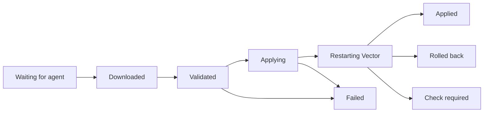

# Deploy your first pipeline

Create a pipeline from the built-in synthetic example, publish it and deploy it to one device. You'll see every stage of a rollout, and no data leaves the device. It takes about 10 minutes.

## Before you start

- A device that shows **Online** in [**Devices**](/#/devices). See [Connect a device](installation.md).
- To build, the Editor or Administrator role. To publish and deploy, the Operator or Administrator role.

## 1. Create the pipeline

<!-- steps -->
1. Open [**Pipelines**](/#/configurations) and choose **Create pipeline**.
2. Name it `Hello Vectory` and choose **Try a synthetic example**.
3. Choose **Create pipeline**.

You should see three connected cards:

| Card | Component | What it does |
| --- | --- | --- |
| `demo` | `demo_logs` source | Generates one JSON log event per second. |
| `enrich` | `remap` transform | Adds `environment` and `managed_by` fields with VRL. |
| `output` | `console` sink | Writes each event to Vector's standard error. The agent discards it, so nothing is stored. |

Select `enrich` to see its VRL program in the right-hand panel:

```vrl
.environment = "development"
.managed_by = "vectory"
```

The example works in restricted mode. It reads no files and sends nothing over the network.

## 2. Check it

Choose the check button in the editor toolbar; before the first check it reads **Not checked**. A sandboxed copy of Vector 0.58.0 on your server validates the complete configuration, and the **Problems** panel under the canvas opens with the result. **Checked** means Vector accepted it. While **Auto-check** is on, the editor also checks again shortly after you stop editing.

If something is wrong, the results name the component and setting to fix. Checks that need the device itself, such as files that only exist there, run on the device before it applies the version.

## 3. Publish a version

Choose **Review & publish**. The review checks the draft again and lists what changes since the last published version, with line-by-line differences for VRL programs. Add a short note such as `First version` and choose **Publish version**.

Publishing freezes the draft as version 1. It changes nothing on any device yet. The confirmation offers **Choose devices** to deploy it now, or **Done** to deploy later.

## 4. Deploy it to your device

<!-- steps -->
1. Select **Choose devices** and your device.
2. Choose **Review deployment**. The review lists the exact devices that will receive the version and whether anything else takes priority on them.
3. Choose **Deploy to devices**, then **View deployment** to follow the rollout.

## 5. Watch it apply

The device picks up the version at its next check-in, within 60 seconds by default. Its pipeline status moves through these states:

<!-- diagram: apply-states -->


| State | What it means |
| --- | --- |
| **Waiting for agent** | Released; the device picks it up at its next check-in. |
| **Downloaded**, **Validated** | The device fetched the signed version and Vector accepted it on the host. |
| **Applying**, **Restarting Vector** | The configuration is written and Vector is loading it. |
| **Applied** | The agent verified Vector runs this version. |
| **Failed** | Rejected or couldn't be applied; the previous configuration keeps running. |
| **Rolled back** | The new version failed to start; the agent restored the last working one. |
| **Check required** | Applied, but the agent couldn't confirm what Vector runs. Look at the device before retrying. |

Only **Applied** means the new version is running. A download, a written file or a started process alone is not proof.

Vectory never stores your events. To confirm on the host that Vector runs the new version, read Vector's own log:

```sh
sudo vectory logs --follow
```

Look for `Vector has started.` The console sink writes events to Vector's standard error, which the agent discards so event data never lands in a file. To watch data flow, [add monitoring](telemetry.md#enable-real-metrics) and open the device's **Operational metrics**.

## 6. Change it and roll back

<!-- steps -->
1. In `enrich`, add a line: `.greeting = "hello"`. Choose the check button, then **Review & publish** to publish version 2.
2. Deploy version 2 to the same device. It replaces version 1 there.
3. To go back, open **Actions → Version history**, select version 1 and choose **Deploy this version**. Review the devices and confirm.

A rollback is a new deployment of an older version. History never changes, and the device checks the older version against today's files and credentials, just like a new one.

## Next steps

- [Build a pipeline](pipelines.md) from your own sources and destinations.
- [Roll out gradually](deployments.md#choose-a-rollout) with a canary and batches.
- [Monitor devices](telemetry.md) with real Vector metrics.
