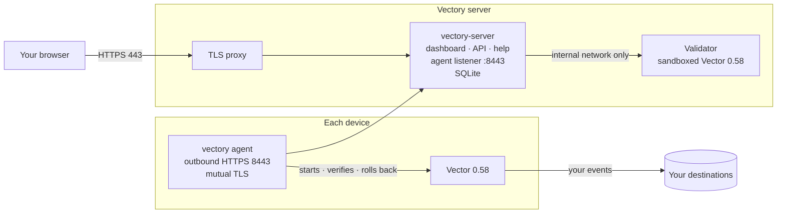

# What is Vectory?

Vectory is a self-hosted control plane for [Vector](https://vector.dev/). Build a pipeline in your browser, publish it as an immutable version, and roll it out to the hosts you choose. A small agent on each host applies the change and reports what Vector is actually running.

## How it works

<!-- diagram: architecture -->

1. **Build** a pipeline in the dashboard. A sandboxed copy of Vector checks it before you can publish.
2. **Publish** an immutable version, then **deploy** it to devices or groups: all at once, on a schedule, or as a canary.
3. The **agent** on each device downloads its signed configuration, validates it with Vector, starts it and confirms Vector is running it. If the new version fails, the agent restores the last working one.

Your events flow from Vector straight to your destinations. They never pass through Vectory.

## Key terms in two minutes

| Term | What it means |
| --- | --- |
| **Pipeline** | A Vector configuration: sources, transforms and sinks connected in a graph. |
| **Draft** | The editable copy of a pipeline. Saving changes only the draft. |
| **Version** | An immutable snapshot of a draft. Devices only ever run published versions. |
| **Deployment** | One version assigned to a set of devices, with a rollout plan. |
| **Device** | A host that runs Vector and the Vectory agent. |
| **Agent** | The `vectory` program on a device. It manages one Vector process and one configuration file. |
| **Group** | A named set of devices that you can target together. |
| **Agent settings** | Check-in interval, configuration sync and metrics collection for a set of devices. |
| **Restricted or full mode** | A choice made on each device. Restricted allows a reviewed set of components and locally approved resources. Full allows everything the device's Vector can do. |
| **Applied** | The agent saw Vector start with the new configuration and keep running. A download alone is not applied. |

The [Glossary](glossary.md) has the rest.

## Know which action you are taking

**Save** updates the draft. **Publish** freezes the draft as a version. **Deploy** sends a version to devices.

Editing a draft never changes what devices run. To go back, deploy an earlier version: see [Roll back deliberately](deployments.md#roll-back-deliberately).

## Navigate your workspace

The sidebar has four destinations:

| Destination | What you do there |
| --- | --- |
| [**Overview**](/#/overview) | See fleet health, what needs attention and recent activity. |
| [**Pipelines**](/#/configurations) | Build, check and publish pipelines. |
| [**Devices**](/#/devices) | Add devices, organize groups and apply agent settings. |
| [**Activity**](/#/deployments) | Follow deployments and schedules, review issues and read the audit log. |

Press **Ctrl K** (**⌘ K** on a Mac) to jump to a page, device or pipeline from anywhere. Your account menu, at the bottom of the sidebar, holds **Settings**, **People & security**, the appearance choice (**Light**, **Dark** or **Auto**), **Single-key shortcuts**, **Keyboard shortcuts**, **Help center** (this site) and **Sign out**.

When you aren't typing in a field, single keys act on the page: **R** refreshes its data, **/** searches it, **?** lists every shortcut, **[** collapses the sidebar, and **G** then a letter goes to a page (**G** then **D** opens Devices). If you use speech input or type with a switch, turn off **Single-key shortcuts** in your account menu so a stray word doesn't refresh or leave the page. This browser remembers the choice. **Ctrl K** and **Ctrl S** (**⌘ K**, **⌘ S**) keep working.

Help links open beside your work in a new tab, so an unsaved pipeline stays exactly as you left it.

## Ports and network flows

| Port | Direction | Purpose |
| --- | --- | --- |
| 443 | Browsers → server | Dashboard, API and this Help center, through the TLS proxy |
| 8443 | Devices → server | Agent enrollment and check-ins (TLS 1.3; mutual TLS after enrollment) |
| 8080, 8081 | Inside the server host only | Vectory's internal HTTP port and the validator. Never expose them. |

Devices only connect out. Nothing on a device listens for Vectory. [Ports and network](ports.md) has the full list, including firewall rules.

## Choose the right access

| Role | Can do |
| --- | --- |
| **Viewer** | View devices, pipelines, deployments and activity; export the audit log. |
| **Editor** | Viewer access, plus create, edit, check and organize pipeline drafts. Cannot publish or deploy. |
| **Operator** | Viewer access, plus publish and deploy, and manage schedules, groups, agent settings, enrollment tokens and device access. Cannot edit drafts. |
| **Administrator** | Everything, including managing people and recovering device identities. |

Editor and Operator are separate jobs, not levels. The server checks every permission itself; the dashboard only hides controls you can't use. See [Administer Vectory](administer.md#create-workspace-accounts) to add people.

## Where to next

- **Try it on one machine** in about 15 minutes: [Quickstart](quickstart.md).
- **Run it for real:** [Install the server](install-server.md), then [Connect a device](installation.md) and [Deploy your first pipeline](first-pipeline.md).
- **Understand the guarantees:** [Security model](security.md).
